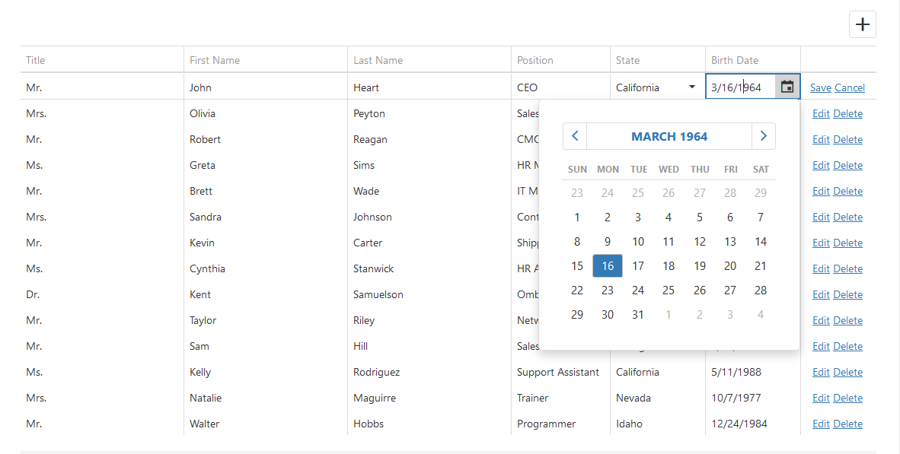

## iview extension

主要是针对于iview做一些后端管理系统复杂DataGrid的定制功能

> 由于本人属于一枚.Neter，层长期使用KendoUI、DevExtreme等企业级数据展示组件，并针对复杂业务场景对其进行定制，深知其重要性，在此也将提供.NetCore 的后端组件，配合起来效率神速，相信大家会喜欢使用

## 目标
- DataGrid
    - [ ] 基本Table数据展示 
    - [ ] Table + Page 
    - [ ] Table + Page + AutoEditForm
    - [ ] Header Filter
    - [ ] Header Sorting
    - [ ] Table Fixed 
    - [ ] Edit Cell
    - [ ] Edit Form 
    - 目标效果截图
        
 